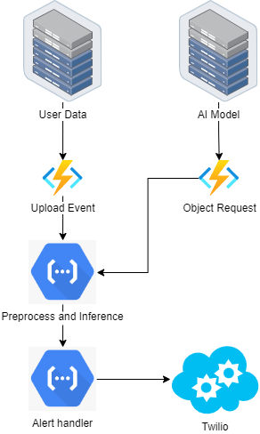
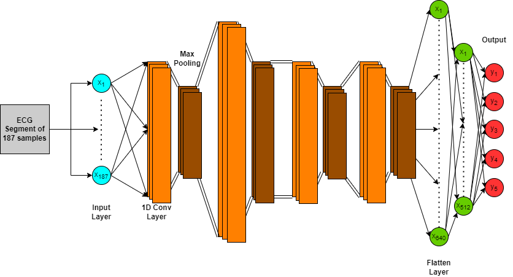
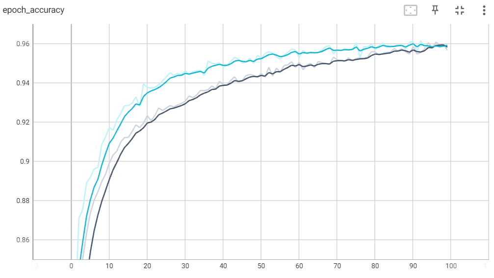
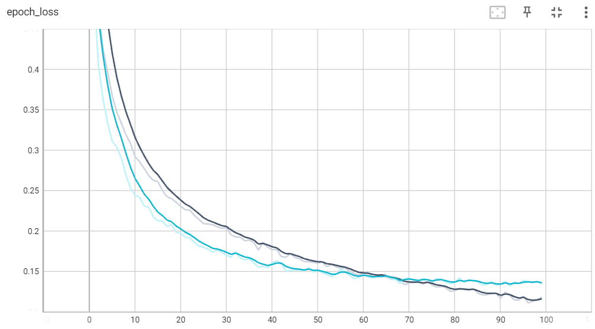
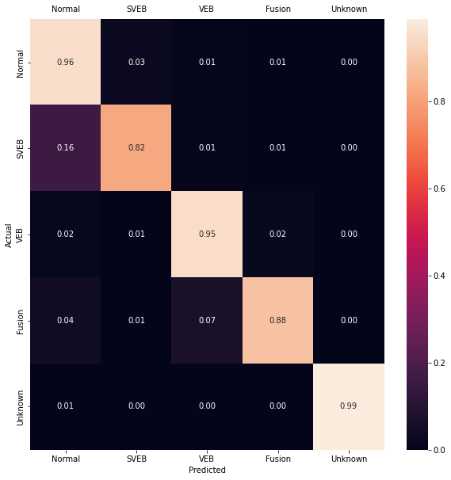

# Hybrid Cloud Deep Learning ECG Classification and Alert System

## Summary

This repository contains files revolving around a system for heart arrhythmia detection via a one-dimensional convolutional neural network. The files contain the model itself along with the cloud functions. The system was originally hosted within GCP.

## What is this about?

There are an increasing number of individuals with heart disease across the globe. ECGs are a commonly used tool to determine what may be wrong with a person's heart. Being able to screen for arrhythmias, or irregular heart beats, is an important step for doctors when determining treatment plans. However, ECGs can result in large amounts of data to process and may require a specialist to analyze it. The goal of this project is to be able to identify 3 types of arrhythmias and alert the patient if they are in immediate need of care. Utilizing the cloud to store ECG data and APIs to send messages to the patient along with an AI to classify the signals, this project could be further built out in time to be a more encompassing solution to balancing physician workload as well as to better communicate with patients as critical arrhythmia episodes arise. Our AI which is based in machine learning utilizing a convolution neural network, was able to achieve up to 96% accuracy and had a run time of 32 seconds. This performance is on par or better than other applications in the field but is more limited in scope.

## What is the architecture?

### Cloud Architecture

The cloud system is rather simple. ECG data is uploaded to a bucket hosting user data, this generates an upload event which triggers the "process-classify" function. This function will process the data, load the model from the "AI Model" bucket, generate an inference and pass it into the "alert-user" REST cloud function. If the result is abnormal, the function will utilize the Twilio API to alert the user.  

### 1D CNN Architecture

This classifier is composed of 14 layers, with an input of 187 nodes, corresponding to the 187 times-steps measured in each of our heartbeat samples and an output of 5 nodes, relating to each heart rhythm category. It utilizes, batch normalization, max pooling, and drop-out for noise addition. The convolution layers utilize ReLu activation functions, and the output utilizes SoftMax.

 

## What were the results?

### Cloud Performance

Our cloud system was evaluated based on the time efficiency of the system. How long it took the system to send an alert, starting from the ECG record upload to the final Twilio trigger. The system’s time efficiency varied greatly depending on the state of the cloud function that handled loading the classifier. From a cold start, which means the function needs to spin up and load in the relevant libraries, our total system time was 32 seconds. However, when called multiple times after the functions were already running (a hot start), the total system time was only 3 seconds.

### Classifier Performance

Our classifier was trained for 100 epochs on data that had an 80/20 train/test split; the model took around 6 minutes to complete training. The nodes were optimized using the Adam algorithm, the loss was measured through categorical cross-entropy and the learning rate was constant at 10-4. The model began to converge to its maximum accuracy after around 50 epochs. The model was able to achieve a training and test accuracy of 96%.  

 

We can see through the confusion matrix that Fusion beats were misclassified as normal or VEB and 16% of SVEB beats were misclassified as normal.

 

 

Essentially this means that when the model predicts a signal is either of Fusion or SVEB classification, then it is most likely correct, however the model may falsely dismiss them to begin with. In the case of Fusion beats, this is fine as the the model would still classify Fusion beats as an arrhythmia, just of a different form, however the SVEB becomes an issue as it is more dangerous to miss a heart arrhythmia than it is to classify a normal signal as problematic. As the model still has a very high accuracy, this simply means the data is too skewed, with far too little representation of SVEB and Fusion signals. It is to be noted however, that the 95% precision on Normal signals still means that the model is able to at least differentiate normal signals versus abnormal signals even if it is not able to correctly determine the specific ailment.
